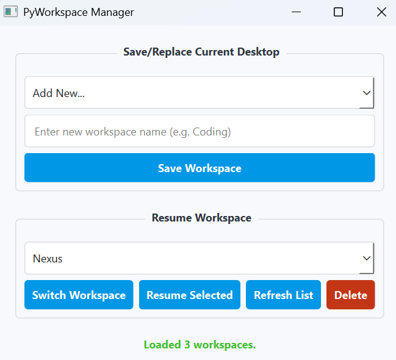

# PyWorkspace

A Windows virtual desktop workspace manager built with Python and PyQt6. Save snapshots of your running programs, open files, and virtual desktop layout — then restore everything exactly as it was with a single click.



## Features

- **Save Workspaces** — Automatically detects all visible programs on your current Windows virtual desktop (executables, arguments, working directories, open files) and saves a complete snapshot.
- **Resume Workspaces** — Restores all saved programs, files, and routes them to the correct virtual desktop.
- **Switch Workspace** — Instantly switch your active Windows virtual desktop to a saved workspace's desktop.
- **Multiple Workspaces** — Manage as many named workspaces as you need (e.g. "Coding", "Research", "Design").
- **Local JSON Storage** — All workspace data is saved locally to `~/.pyworkspace_data.json`. No cloud account or API keys needed.
- **Delete Workspaces** — Remove workspaces you no longer need.

## Requirements

- **Windows 10/11** (virtual desktop features require Windows)
- **Python 3.10+**

## Installation

```bash
pip install pyworkspace
```

## Usage

### Launching the GUI

After installation, simply run:

```bash
pyworkspace
```

This opens the **PyWorkspace Manager** window with two sections:

### 1. Save/Replace Current Desktop

1. Select an existing workspace name from the dropdown to **replace** it, or choose **"Add New..."** and type a new name.
2. Click **Save Workspace**.
3. PyWorkspace will scan all visible programs on your current virtual desktop and save a full snapshot (program paths, arguments, working directories, window titles, and open files).

### 2. Resume Workspace

1. Select a saved workspace from the dropdown.
2. Click **Resume Selected** to restore the workspace:
   - Switches to the workspace's original virtual desktop.
   - Clears any existing programs on that desktop.
   - Re-launches all saved programs with their original arguments and working directories.
   - Re-opens all previously open files.
3. Click **Switch Workspace** to only switch your view to that workspace's virtual desktop (without launching any programs).
4. Click **Refresh List** to reload the workspace list.
5. Click **Delete** to permanently remove a workspace.

### Programmatic Usage

You can also use PyWorkspace as a Python library:

```python
from pyworkspace import Workspace, Session

# Create a workspace
ws = Workspace("Development")
ws.add_program(r"C:\Program Files\MyEditor\editor.exe", args="--project myapp")
ws.add_file(r"C:\Projects\myapp\README.md")

# Save and manage via session
session = Session("dev_session.json")
session.add_workspace(ws)
session.save()

# Later, resume everything
session.resume()
```

## How It Works

1. **Scanning**: Uses `psutil` and `pywin32` to detect all visible windows on the current virtual desktop, capturing executable paths, command-line arguments, working directories, and open file handles.
2. **Virtual Desktop Detection**: Uses Windows COM APIs and the `pyvda` library to identify which virtual desktop each window belongs to, and to move windows between desktops.
3. **Storage**: Workspace data is persisted locally as JSON at `~/.pyworkspace_data.json`.
4. **Restoration**: Programs are re-launched via `subprocess.Popen`, files are opened with `os.startfile`, and windows are routed to the correct virtual desktop using `pyvda`.

## Dependencies

Installed automatically via pip:

| Package | Purpose |
|---------|---------|
| `PyQt6` | GUI framework |
| `psutil` | Process and window detection |
| `pywin32` | Windows API access |
| `comtypes` | COM interface for virtual desktops |
| `pyvda` | Virtual desktop switching and window movement |

## License

MIT
